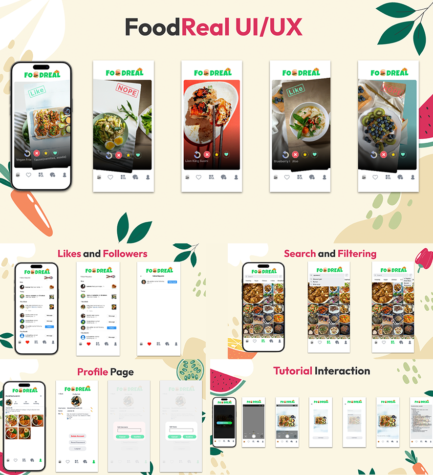
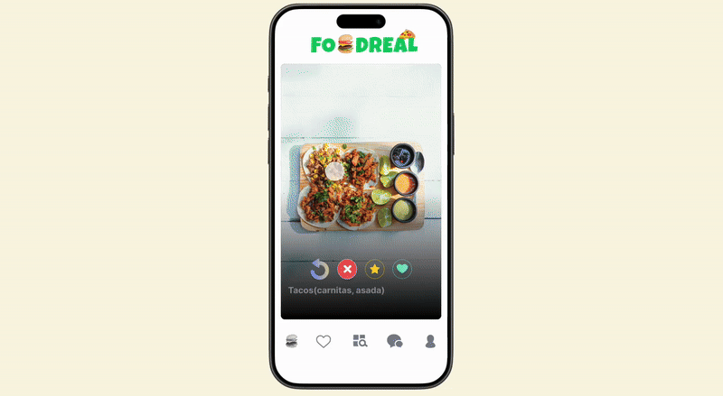

# FoodReal

FoodReal redefines home cooking by combining real-time social engagement. Each day, users receive a spontaneous notification encouraging them to share their real-life meals, fostering authenticity over curated perfection.The app’s swipe-based discovery system enables users to connect with home-cooked meals locally and globally. 

**Developer Team members**
- Nutthawat Panyangnoi 
- Benjamin Lim
- Ryan Rigor
- Marlon Villalobos
- Uyen Vu

# Just Swipe to explore new menu!

